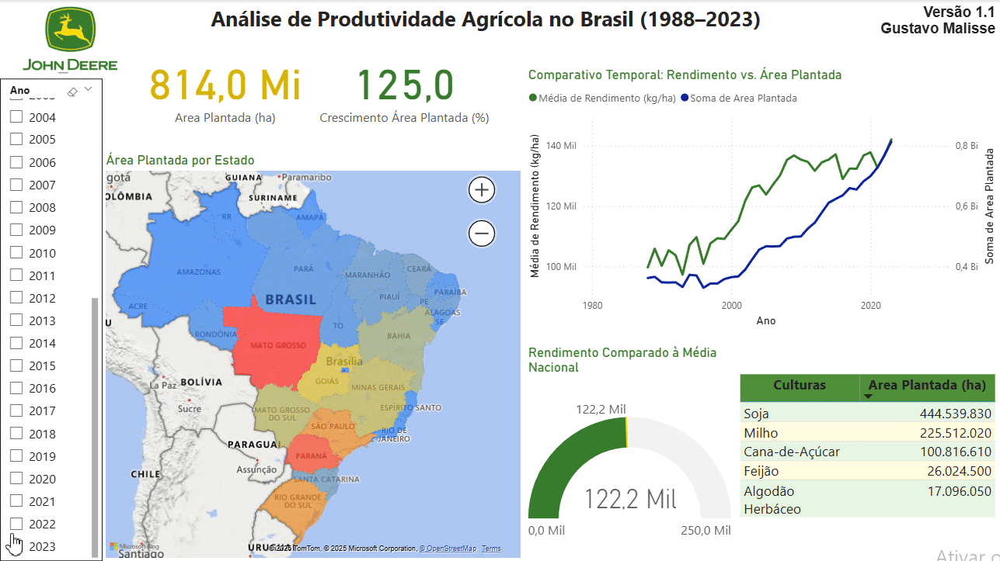
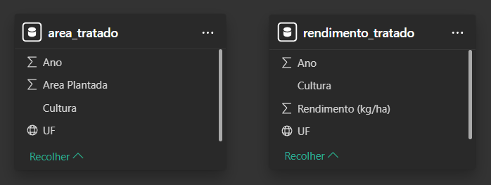
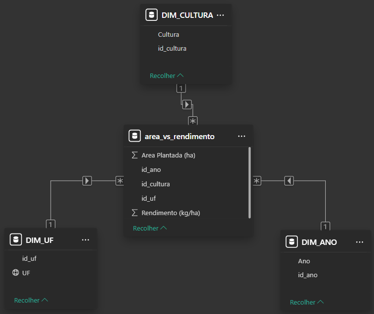

# 📊 Dashboard de Análise de Dados - John Deere

Projeto de análise de dados desenvolvido como parte de uma iniciativa pessoal para a visita à empresa John Deere. O objetivo foi cruzar dados de **área plantada** e **rendimento agrícola** para gerar insights relevantes de forma visual e acessível.


---

## 🧰 Tecnologias e Ferramentas Utilizadas

- Python (Pandas)
- Power BI
- Excel
- CSV

---

## 🚀 Como Executar o Projeto

### 1. Clonar o repositório
```bash
git clone https://github.com/gmalisse/area-plantada-vs-rendimento.git
```

### 2. Abrir o Dashboard no Power BI

Abra o arquivo `dashboard.pbix` no Power BI Desktop para visualizar os gráficos.

### 3. Rodar Script (opcional)

Os arquivos CSV com os dados tratados já se encontram no repositório tornando esse passo opcional. Pode-se abrir o arquivo `scripts/tratamento_dados.py` para visualizar e testar o tratamento de dados feito com Python. Este projeto utiliza a biblioteca [pandas](https://pandas.pydata.org/) para tratamento de dados.  
Se você ainda não possui o pandas instalado, rode o seguinte comando no terminal:

```bash
pip install pandas
```

 Antes de rodar o script, alterar o caminho do arquivo csv original e do tratado de acordo com sua máquina.

---

## 🛠️ Etapas do Projeto

### 1. Extração de Dados 
   Os dados foram obtidos a partir do site oficial do [SIDRA/IBGE](https://sidra.ibge.gov.br/tabela/1612). No site é possível definir o modelo que a tabela será baixada. As tabelas baixadas seguem o modelo relacional tradicional, onde cada coluna representa um atributo (ex: cultura, ano, UF) e cada linha representa uma tupla, permitindo a fácil manipulação, cruzamento e análise dos dados.
 Foram selecionadas e baixadas no formato CSV as seguintes tabelas para os anos de 1988 a 2023:
   - Área plantada (ha)
   - Rendimento médio da produção (kg/ha) 
   Todas referentes às principais lavouras do país.

### 2. Pré-processamento no Excel 
   Os arquivos CSV foram abertos no Excel para pequenas correções manuais, como substituição de caracteres especiais: `ã` por `a` e `ç` por `c`.

### 3. Tratamento de Dados com Python (Pandas)
   Os dados foram tratados e limpos utilizando a biblioteca `pandas`, com foco em:
   - Padronização de colunas
   - Definição de separador e valores nulos
   - Remoção de linhas desnecessárias como cabeçalhos múltiplos e linhas de fonte e notas do IBGE

### 4. Importação e Modelagem no Power BI
   Os arquivos CSV tratados foram carregados no Power BI para construção do modelo de dados e visualizações.
   Ao importar o modelo inicial era:
   

### 6. Unificação das Tabelas de Fato 
   Como as três tabelas possuiam colunas em comum (cultura, UF, ano), foi realizada uma junção (INNER JOIN) entre elas no Power Query, criando uma tabela fato única. As tabelas originais foram desabilitadas da carga para otimização do modelo.

### 7. Criação de Tabelas Dimensão
   Foram criadas tabelas dimensão diretamente no Power BI para segmentar e organizar as informações, como:
   - Dimensão de Culturas
   - Dimensão de Unidades da Federação
   - Dimensão de Período  
   O uso de SQL foi descartado neste caso, pois o volume de dados não exigia um banco de dados relacional robusto.

### 8. Modelagem em Estrela 
   O modelo de dados foi estruturado no formato estrela (Star Schema), com relacionamentos 1:N entre as tabelas dimensão e a tabela fato, garantindo melhor desempenho e facilidade na manutenção e expansão do projeto:
   

### 10. Criação do Dashboard no Power BI
   Com os dados tratados e o modelo relacional estruturado, foram desenvolvidas visualizações interativas no Power BI para facilitar a análise dos dados. O dashboard foi construído com foco em:
   - Clareza visual e facilidade de interpretação
   - Comparações entre culturas, estados e anos
   - Identificação de padrões como alta produção com baixo rendimento ou vice-versa  
   Foram utilizados gráficos de colunas, linhas, mapas e segmentações, além de KPI's em cards para tornar a análise intuitiva e acessível mesmo para quem não tem familiaridade com os dados. Além disso, todo o dashboard foi estilizado com as cores da empresa John Deere
   
---

## 📊 Insights Extraídos

Apesar de o conjunto de dados abranger o período de 1988 a 2023, a análise foi focada nos últimos 10 anos (**2014-2023**) para garantir maior relevância e atualidade nos insights. A partir da análise, foram identificados os seguintes destaques:

- **🏆 Culturas Dominantes**
  
A **soja representa 55%** da área plantada nacional, sendo a principal cultura agrícola do Brasil, seguida por **milho (28%)** e **cana-de-açúcar (12%)**.

A **soja e o milho** predominam nas regiões **Centro-Oeste e Sul**, que formam o grande polo nacional da agricultura. Para ambas as culturas, a área plantada vem acompanhando o rendimento, o que pode indicar que o **crescimento está  ocorrendo de forma sustentável**, com ganhos em produção proporcional ao aumento de área.

Enquanto isso, a **cana-de-açúcar** apresenta **predominância absoluta no estado de São Paulo**. Essa cultura teve uma **pequena redução de 3,6% na área plantada**, com oscilações ao longo do tempo, enquanto seu **rendimento cresceu 5%**, indicando uma **estabilidade produtiva**.  
É importante destacar o **rendimento excepcional dessa cultura**, que foi de **606,5 toneladas por hectare** no último ano analisado, muito acima das demais.

Dado o seu **papel central no agronegócio brasileiro**, é fundamental manter e ampliar **investimentos em tecnologia, pesquisa e infraestrutura** nessas culturas e regiões com grande área plantada e altos rendimentos. Isso assegura a continuidade do crescimento sustentável e fortalece o Brasil como potência agrícola global.
  
- **🌾 Caso de Destaque: Rondônia**

 Nos últimos **10 anos (2014-2023)**, o estado de **Rondônia** apresentou um crescimento expressivo de **152% na área plantada**, evidenciando uma forte expansão da atividade agrícola. No entanto, no mesmo período, houve uma **queda de   37,2% no rendimento (produção por hectare)**.

 Esse contraste sugere um **descompasso entre expansão e eficiência**, indicando um possível **potencial para investimentos em modernização e maquinário agrícola**.

 Além disso, a **distribuição de culturas em Rondônia** é bastante semelhante à do estado vizinho **Mato Grosso**, com predominância de **soja e milho**, o que reforça a viabilidade de adotar estratégias e tecnologias já consolidadas na  região central do agronegócio brasileiro.

 - **🌾 Caso de Destaque: Rio Grande do Sul**

O estado do **Rio Grande do Sul** possui uma área plantada sete vezes maior que Rondônia, sendo um dos principais produtores agrícolas do país. Nos últimos **10 anos (2014-2023)**, houve um crescimento de **25,1% na área plantada**, indicando uma expansão consistente, porém mais moderada em relação a estados emergentes.
Apesar disso, o estado registrou uma **queda de 16,5% no rendimento**. Essa redução pode estar relacionada a **questões climáticas**, **condições do solo**, ou até mesmo à necessidade de **investimentos em tecnologia e infraestrutura agrícola**. 

---

## 🔍 Próximos Passos

Esta análise oferece uma visão geral da evolução da área plantada e do rendimento agrícola no Brasil entre 2014 e 2023. No entanto, para extrair **insights mais precisos e direcionados**, seria interessante cruzar esses dados com outras variáveis contextuais, como:

- **Características do solo** (fertilidade, acidez, textura)
- **Dados climáticos** (índices de chuva, temperaturas médias, ocorrência de secas)
- **Relevo e altitude**
- **Tipo de maquinário e tecnologia utilizada**
- **Práticas de manejo agrícola** (uso de irrigação, rotação de culturas, fertilizantes)

A inclusão dessas informações permitiria entender melhor os fatores que afetam o rendimento e apoiar decisões estratégicas para investimentos mais eficientes no setor agrícola.


